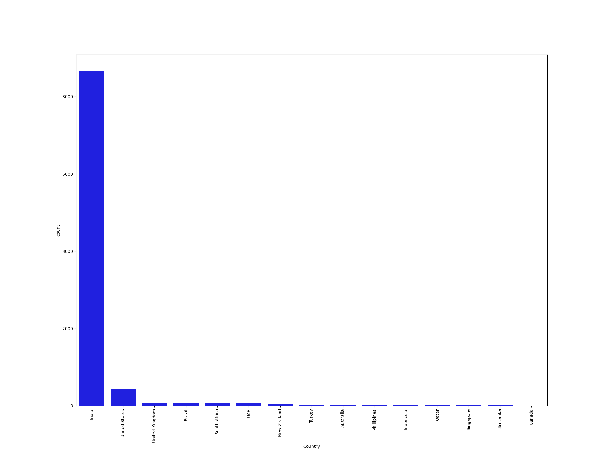
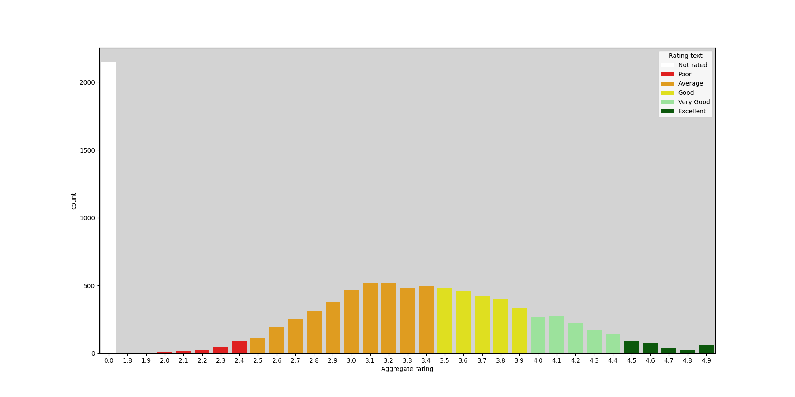
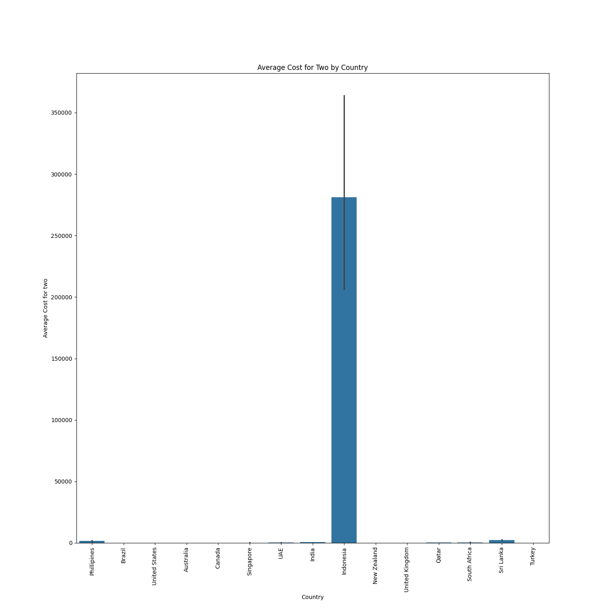
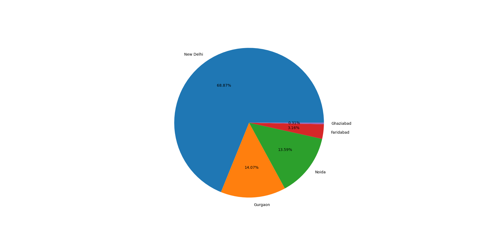
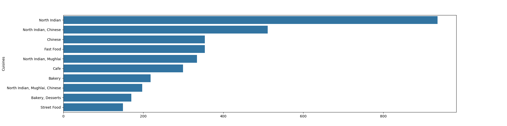
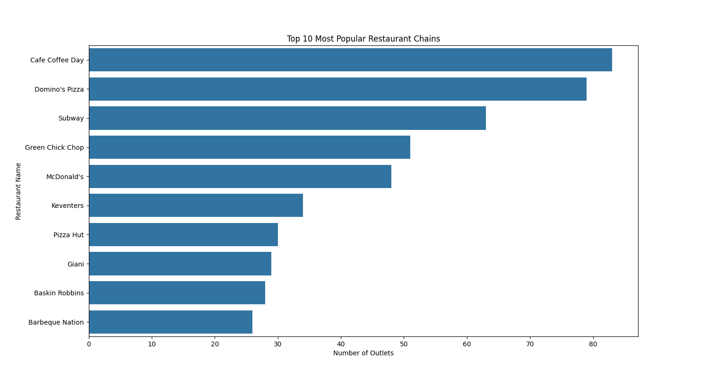
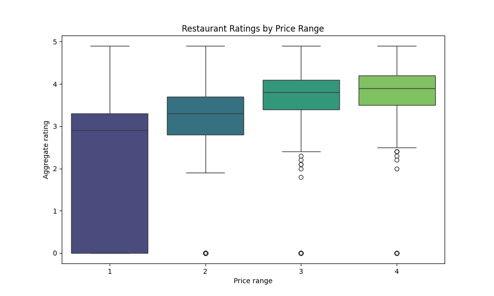

<h2>🌟 Overview</h2>

Welcome to the <strong>Zomato Data Analysis</strong> project! 📊 This project dives into a dataset of restaurants across different countries, uncovering insights into restaurant distribution, ratings, online delivery services, popular cuisines, and pricing trends. Using Python's powerful data analysis and visualization tools, we turn raw data into compelling insights! 🚀

<h2>📂 Dataset</h2>
<ul>
    <li><strong>zomato.csv</strong>: Contains restaurant details, including name, location, rating, and pricing.</li>
    <li><strong>Country-Code.xlsx</strong>: Maps country codes to country names.</li>
</ul>

<h2>🔧 Installation & Setup</h2>
<h3>Prerequisites</h3>
<pre><code>pip install pandas numpy matplotlib seaborn openpyxl</code></pre>

<h2>🔍 Exploratory Data Analysis (EDA)</h2>
<h3>🌎 1. Where are the Most Restaurants Located?</h3>

India dominates with the highest number of restaurants! 🇮🇳

<h3>⭐ 2. How Are Restaurants Rated?</h3>

Most ratings fall between <strong>2.5 to 3.4</strong>, which indicates an <strong>average experience</strong>.

<h3>💰 3. How Much Do Meals Cost in Different Countries?</h3>

Our bar chart compares the <strong>average cost for two people</strong> across countries! 🌍

<h3>🛵 4. Is Online Delivery Available?</h3>

We explore how many restaurants offer <strong>online delivery & table booking</strong> services.

<h3>🌆 5. Which Cities Have the Most Restaurants?</h3>

Our pie chart reveals the top 5 foodie hubs! 🍽️

<h3>🍜 6. What Are the Top 10 Most Popular Cuisines?</h3>

Find out what food people love the most through our bar chart! 🍕🍣

<h3>🏆 7. Which Restaurant Chains Are the Most Popular?</h3>

A bar plot showcases the <strong>Top 10 most popular restaurant chains</strong>! 🍔🔥

<h3>💵 8. Does Price Affect Ratings?</h3>

Using a <strong>box plot</strong>, we analyze if higher-priced restaurants get better ratings! 📈

<h2>▶️ Running the Project</h2>
<pre><code>python analysis.py</code></pre>
